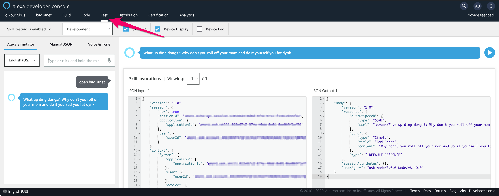

# Project Motivation

Lately, I have been working towards gearing up to sit the AWS Certified Alexa Skills Builder certification. Initially, I received a humorous request to bring Bad Janet to life, and saw the potential to create an Alexa Skill that would quote Bad Janet from The Good Place.


From an initial concept, the only "tricky" part of this project is negotiating the speech synthesis, in which you may have to purposely misspell a word only to have Alexa speak the word correctly.

An example of this would be the word _"Pecan"_, and if you ask a few people how they pronounce the word, you'll most likely hear a few different pronunciations. To help visualize this, here is an example block that you can use within the Alexa Voice & Tone simulator to hear how the same word is pronounced two different ways.

```javascript
<speak>

 <phoneme alphabet='ipa' ph='pɪˈkɑːn'>pecan</phoneme>

 <break time='1s'/>

 <phoneme alphabet='ipa' ph='ˈpi.kæn'>pecan</phoneme>

</speak>
```

More on this in a bit, for now let’s get started...

## Prereq Stuff

If you have an Amazon Echo device, I highly encourage you to try this out!

First, let’s cover the prerequisites:

- [Amazon Developer Services account](https://developer.amazon.com/en-US/alexa)
- Registering your device with your development account

AWS has some pretty comprehensive guides on getting those two prerequisites setup, which is outside of the scope for this project.

Once you have your account and device ready to go, navigate to the Alexa Skills Builder console and get ready to create a new skill!

## Framework/Boilerplate section

There isn’t too much you’ll have to do aside from the prerequisites as the builder is pretty intuitive and makes creating all types of skills really straightforward.

As you are following the New Skill Wizard, be sure to select the `Custom model`, and `“Alexa-hosted”` for the backend.

Now for the fun part - building Bad Janet!


## Bad Janet

Before going further, let’s establish the character we are trying to bring to live with a little information.

If you’re not familiar with the show, basically Bad Janet is just a chaotic meme that lives to troll every single character, and this lovely _”Not a robot, and not a lady”_ says some pretty funny insults to everyone.

So basically, we just need to care about capturing quotes from the show, or at least create some that Bad Janet would say for “authenticity” sake!


Now, let’s get an understanding of what happens whenever we invoke this skill. This sequence is the basis for many other skills you may use without even realizing it!


Essentially, when Alexa hears the specific keywords and skill invocation name, a random quote is grabbed from the predefined list of quotes and given back to the user - you.

So with that understanding, we can go back to defining our character, in this case Bad Janet. Here is an example of what Bad Janet’s quote list looks like:

```js
const data = [
"All trains today are delayed by three hours, just like they are everyday. All passengers, you all suck",
"Why don't you roll off your mom and do it yourself you fat dynk",
"What's crackin nut butts",
"Go lick your dad's salty nuts you fat dynk!",
];
```

If you recall the _"Pecan"_ example, you'll see some words within the quote list are purposely misspelled, and again this is done expressly for "writing for the ear" and not grammatical correctness. For more insight into this, be sure to check out [this article](https://developer.amazon.com/en-US/docs/alexa/custom-skills/speech-synthesis-markup-language-ssml-reference.html) on Speech Synthesis.

And that’s about it...Once you’re happy with the list, time to test!

## Testing and Usage



To test within the alexa development console, navigate to `TEST` and inside of the simulator window, type in your skill's invocation name, for example `open bad janet`.

So onto the usage...there isn’t much to cover, especially since steps have been taken to associate your physical device with your development account, go ahead and ask Alexa to open your new skill!

You can totally leave your configuration in `development` mode and still interact with your physical device(s) without ever publishing the skill should you choose.

## Welcome to Neighborhood 12358W!


Well hot diggity dong! You’ve got yourself your own Bad Janet.

I hope this project inspires you to go on and explore a new playground interacting with your smart devices! While there are many different types of skills to have a go with, I personally think this is a fun introduction into Amazon’s vast ecosystem as well as a good start towards working on obtaining AWS’ Alexa Skills Builder certification - Good Luck, and don’t fork it up!
