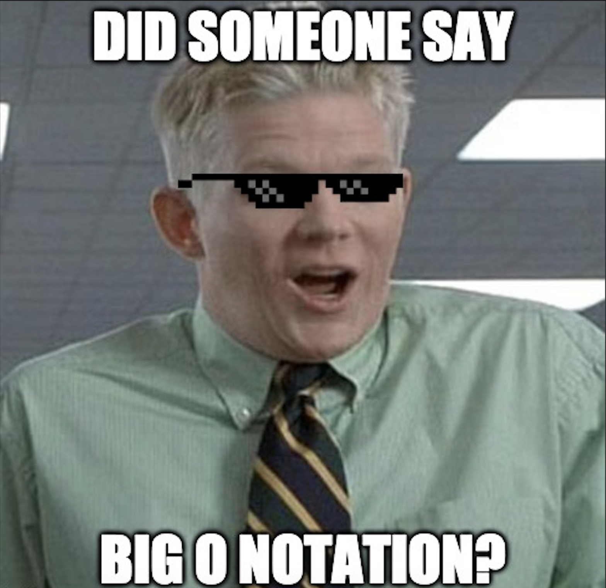

A look at one of my old engineering notebooks containing notes about the Big O Notation.

# Understanding Big-O Notation

The simplest explanation of Big-O notation is that it serves as **a metric for algorithm scalability**.

If you are currently cringing, or just trying to learn then stick around! You may find the answers you seek...



All memes aside, let's break down the opening statement by first establishing an understanding of algorithms first.

**_An algorithm is just a series of steps for solving a problem._**

Okay, not too bad, let's take a look at one of the basic questions this notation solves for:

**_How much harder does something get as you increase your input?_**

The entire point of Big-O notation is to be able to compare how efficiently one algorithm solves big problems compared to another. Now, let's take a look at one of the most common graphs that helps us to visualize this:


For now, just remember the overall relation between time and input size, and how they look on this graph - I think it'll make more sense as you progress through each Notation and view some of the example code snippets.

Now back to it - Let's say you have a giant dataset, a list of names for instance. How would you go about determining the best possible way of sorting or searching this list of names? Imagine if you had a list of 10 names, another list of 100 names, or even a list of 1000 names.

This is what Big-O notation tells you! It tells you how well a particular algorithm will do against various problems, such as searching a list of 1000 names.

## Notation: O(1)

Known as Constant Complexity.

Essentially, no matter what you provide as input to the algorithm, it will still run in the same amount of time.

Taking our list of names dataset:

- 1 item, 1 second
- 10 items, 1 second
- 100 items, 1 second

**Code Example**

```javascript
function constantFunction(n) {
  return n*n;
}
```

Additional real world examples include:

- Determining if a binary number is even or odd
- Using a constant-size lookup table

## Notation: O(log n)

Known as Logarithmic Complexity.

It’s helpful to think of logarithms as exponents in reverse. Basically the calculation time barely increases as you exponentially increase the input numbers.

Back to our list of names:

- 1 item, 1 second
- 10 items, 2 seconds
- 100 items, 3 seconds

**Code Example**

```javascript
function logFunction(n) {
  for (let i = 1; i < n; i*=2) {
      const result = i;
      console.log(result);
  }
}
```

Real world example(s):

- Binary search
- All operations in a Binomial heap

## Notation: O(n)

Known as Linear Complexity.

This is probably the easiest one to grasp as the calculation time increases at the same pace as the input.

- 1 item, 1 second
- 10 items, 10 seconds
- 100 items, 100 seconds

**Code Example**

```javascript
function linearFunction(n) {
  for (var i = 0; i < n; i++) {
      console.log(i)
  }
}
```

Example:

- Unsorted list search

## Notation: O(n2)

Known as Quadratic Complexity.

This might be tricky, especially if you don't like to get mathematical..

Remember that things raised to the second power means to multiply times itself.

The calculation time increases at the pace of n2.

- 1 item, 1 second
- 10 items, 100 seconds
- 100 items, 10,000 seconds

**Code Example**

```javascript
function (int i = 0; i < n; i += c) {
  for (int j = 0; j < n; j += c) {
      // O(1) expressions
  }
}
```

Real world example: Bubble sort

## Notation: O(n!)

Known as Factorial Complexity, and is probably the biggest gotcha when learning Big-O.

Essentially, `N!` is a bad place in the algorithm world. Like very bad...

It means it’s basically unsolvable.

The calculation time increases at the pace of `n!`. For example:

```sh
# if n = 5
5x4x3x2x1 = 120
```

This isn’t so bad at low values of `n`, as in this example where `n = 5`, but it quickly becomes impossible when the values increase. Taking a look at a few other examples:

- N=1, 1 option
- N=10, 3,628,800 options
- N=100, 9.332621544×10157 options

Real World Example: Traveling salesman problem

_"Given a list of cities and the distances between each pair of cities, what is the shortest possible route that visits each city and returns to the origin city?"_

While this isn't so much unsolvable, it's computationally difficult and even more difficult to optimize.

## Wrapping up

While the concept does take some time to become familiar with, you more than likely are dealing with Big O more than you realize - especially if you instantly connected to the code snippets, as most of them are the foundations for many algorithms.

Hopefully this helps shed some light on the topic, while there are many great sources on the Net, these notes serve as a great refresher whenever I have to go under the hood on challenging algorithmic problems.
