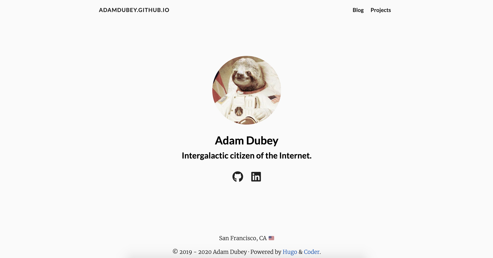

## Migrating to Hugo

_I've really put this project off for too long..._

It's finally time to migrate my blog (_this site_) to Hugo from Jekyll. The primary reason and desire to do this is simply because I have just grown tired of juggling all of the nuances with the Ruby/Jekyll ecosystems. While I still support a few project sites powered by Jekyll, I'd rather focus more on crafting content for my blog and less effort on maintenance.

So Hugo, welcome - glad you are the solution here! I've yet to spend more than a few hours tinkering with this tech stack, but overall:

- it's fast and intuitive
- gentle learning curve (pick a theme you like, and follow the basic example structures provided)
- way less bloat than you get with the Ruby/Jekyll stack

Well with some extra time in the schedule, and it currently being Summer, I felt inspired to set a fun challenge to tackle this migration... a Hackathon!

## My Summer Hackathon 2020: A new challenger appears!

Okay, this is starting to become exciting - dedicate a few days to just primarily focus on this migration project and take care of some housekeeping with a bit of backlogged material, and bonus points to aligning the event with the weekend to get a few late nights of work in.

**Project Outline:**

- Setup Hugo/template framework
- Configuration details
- Migrate existing posts/projects
- Establish deployment workflow
 - Bonus Points for CI/CD integration (_it'll happen either way 😏_)

**My proposed schedule:**

_Basically just mixing the Olympics with a Hackathon..._

I felt this to be a good balance of dedicated time to allocate, especially since I still have to go to work and deal with some other ongoing projects. All in all, I think I could've cut a day out of this and still would be fine.

- Day 0: 18 June
- Day 1: 19 June
- Day 2: 20 June
- Day 3: 21 June
- Day 4: 22 June

Ultimately, the target goal is 80% of the migration in a completed state, I don't want to rush this, and am purposely setting the stage to just enjoy working through any challenges that come my way. Additionally, I don't anticipate deploying the site until a few days afterwards just so I can cross-check everything before launch.

## Deploying 🚀

It seems there are a few ways of deploying a Hugo site...? Yeah I don't know what the most pragmatic approach to deployments is, since the official documentation doesn't quite make it easy for just a single repo site hosting because all the variations I've tried ended as `failure to launch`.

_I want my Hugo blog damnit!_

However, when it came time to deploy this time I got it on the first try! 😍

Here are the steps I took to deliver a successful deployment:

**NOTE:** You only need to deploy the contents of `/public` onto the `master` branch!

1. Run `hugo` to build the site and produce the `/public` artifact
2. You only need to deploy the contents of `/public`;
  1. Lazy way is to just copy/pasta the files from `/public` over to the root project directory
3. Commit & Push;
  1. Follow typical PR workflow to merge into `master`

And that's it... that was the "magic bullet" that worked for me. So far it's been the only process that has worked every time for just _"Hugo blog + Github Pages hosting"_ deployments. Now it's certainly not the most glamorous way of going about it, but it's easy to automate based on your workflow.

Unfortunately I ran short on time to really focus on building and defining a CI/CD pipeline for this project, and just haven't implemented anything quite yet. At some point I'll have some form of git hook + CI server to perform the heavy lifting and management of building. You can get a sense of all sorts of variations and possibilities around automating your workflow... The sky's the limit as to what you can automate!

## Results & Reflections

Wow, what a huge difference! I found my workflows with Hugo way more streamlined than before with Jekyll, which is a huge plus! 👍 Also, I'd be remiss if I didn't mention not having to worry about several different flavors of syntax, just Markdown and Yaml (_for the most part_).

Overall I really enjoyed framing this project as a Hackathon. Sometimes it really helps to just change your frame of mind as frankly I haven't been feeling inspired to do much work on personal projects. Simply just dedicating a few days of just exclusively work on this project, I was able to complete the migration quickly and really reignite a renewed sense of passion once more!

Lastly, a look at where the site has come from, and where it is currently:

**(Jekyll) Legacy V1 Site:**

---

**(Hugo) Current V2 Site:**

---

Thank you very much for reading!
