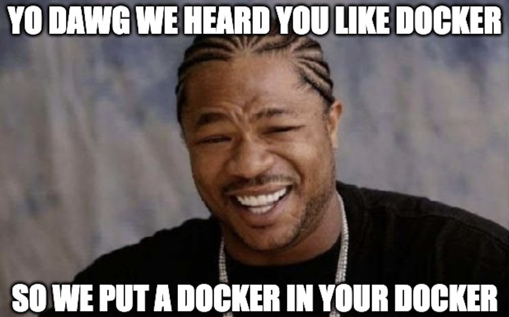
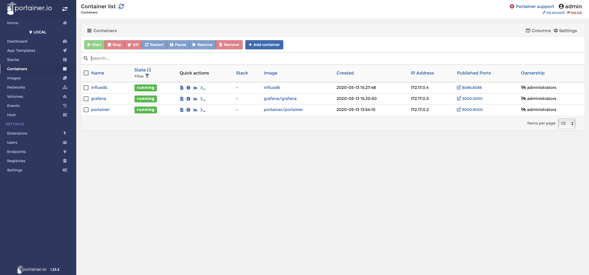

Taking a look into management solutions for negotiating container sprawl within my homelab.

# The problem keeps growing

If you are a Docker fan, then this should be a treat! Think about how many times you've had to execute `docker ps -a` just to see a list of all the containers you have running on a given system. Now imagine you are maintaining several servers plus your main development rig...



Just within my homelab alone, there is a  minimum of 30 containerized services, which wasn't too terrible to manage for awhile (_although extremely tedious_). From past experience supporting production systems where Docker was leveraged, the total number of containers wasn't too bad at most places, but I've also been the one on the hook for supporting instances of 50+ containers without any form of management, just all CLI... yikes.

So after researching and experimenting in the lab, I've finally found something that can appease the masses both C-Suite and Engineers alike! Here is my journey of discovery and implementation of Portainer, which really is a game changer for managing containers quickly and effortlessly.

## Portainer & Docker: A cursory overview

Docker is typically described as _“Enterprise Container Platform for High-Velocity Innovation”_ and that about sums it up pretty nicely...kinda. I think folks get hung up on some of the deep technical aspects which adds fuzz to the basic understanding, but basically Docker containers provide a standardized environment for your applications to live in. There are numerous ways to configure your container, such as software and operating systems, however all of the containers are sharing the same host hardware, and most importantly the kernel.

Portainer is simply just a management UI to manage Docker environments. I tend to live in the CLI myself, but sometimes GUIs are nice too, especially if you are managing multiple Docker environments.

Through several days of experimenting, multiple variations and approaches to administration and pushing the boundaries, I don't think Portainer really fits my particular workflows other than being useful for getting granular centralized telemetry data of my Docker containers.

So with that being said, here are my two best approaches to working with Portainer in your own labs...

## Option 1: Installing the Docker Host VM with Photon

For my lab stack, I’m going with Photon OS. If you haven’t used it yet within your homelab, definitely give it a go! It’s really lightweight, and pretty seamless getting an instance running in VSphere since there are both OVA and ISO files.

Follow the process to get the Photon OS VM created per your environment, and perform the setup steps such as changing your password.

Next, we will need to configure Docker, which couldn’t be any easier with PhotonOS - Just enter these two commands:

```sh
$ systemctl start docker
$ systemctl enable docker
```

In a grand total of 3 minutes, I now have a VM to muck up as much as I want with Docker experiments! Not a big deal if shit goes sideways, rollback to a snapshot or just rebuild the whole VM!

## Option 2: Install the Docker Host VM with Ubuntu

I have to admit that I like this option a little bit more than the prior, mainly because I don't have to context switch as much when it comes to managing the host OS. However, this approach does take a little more time (_even with automation_), but is totally worth it - especially if you remember to snapshot the VM before proceeding...Into the Production stack will go a fresh VM with the latest Ubuntu offering!

```sh
# Update system packages

$ sudo apt-get update
$ sudo apt-get upgrade

# Install Docker and enable service

$ sudo apt install docker.io
$ sudo systemctl start docker
$ sudo systemctl enable docker

# Fix Permissions to make Docker administration easier

$ sudo usermod -aG docker ${USER}
$ su - ${USER}
```

And just like that, a new VM is ready and awaiting...

## Configuring Portainer

Typically I test out a new service in my Lab stack manually first. If the new service (app, service, something that does a function, w/e) is something that needs to live in Production, then I typically build it into my PROD Docker Compose file.

On the other hand, if it’s purely a lab specific application, I will first create a Dockerfile to make localhost development a bit easier and container, and then proceed to Docker Compose.

Now back to Portainer… Let's take a look at bringing up Portainer manually first:

```sh
$ docker container run -d \
-p 9000:9000 \
-v /var/run/docker.sock:/var/run/docker.sock portainer/portainer
```

So just vanilla Docker commands, no Dockerfiles, no Docker Compose. This is completely fine if it’s how you choose to manage your infrastructure, however I’d encourage at least spinning up a core service such as Portainer in a Docker Compose file as it makes management way easier.

Docker Compose file to build expressly for Production:

```yml
# docker-compose.yml

version: "3"
services:
#####PORTAINER#####
portainer:
  container_name: portainer
  image: portainer/portainer
  volumes:
    - portainer_data:/data
    - /var/run/docker.sock:/var/run/docker.sock
  restart: always
  ports:
    - "9000:9000"

#####VOLUMES#####
volumes:
portainer_data:
```

Sweet, just a simple command and I’m done, much easier to manage. Just a quick aside, here is that same Docker Compose file with an instance of InfluxDB to be created at the same time:

```yml
# docker-compose.yml

version: '3'
services:
#####PORTAINER#####
portainer:
  container_name: portainer
  image: portainer/portainer
  volumes:
    - portainer_data:/data
    - /var/run/docker.sock:/var/run/docker.sock
  restart: always
  ports:
    - "9000:9000"
#####INFLUXDB#####
influxdb:
 container_name: influxdb
 image: influxdb
 restart: always
 ports:
   - 8086:8086
 volumes:
   - influxdb_data:/var/lib/influxdb
```

Basically, Portainer is able to “see” all other containers that are deployed on the same host, but you’ll have to finish the install steps which you can do by opening the Portainer GUI in your web browser of choice, and navigating to your instance’s IP address followed by the port number, for example:

`192.168.3.27:9000`

And that’s it! Just follow whatever wizards lurk ahead _(stuff changes all the time, and whatever I write will probably be obsolete soon)_.

## Next Steps

Now that the service is running, you can add whatever containers you want to be monitored by Portainer, just by spinning up a new service or adding to your existing docker-compose file and re-building.

As an example, here is my current Lab stack testing a TIG stack _(Telegraf, InfluxDB, Grafana)_ for centralized telemetry:



While this solution may not be for everyone, I can attest to great success and less headaches.

Happy experimenting! 👨‍🔬
