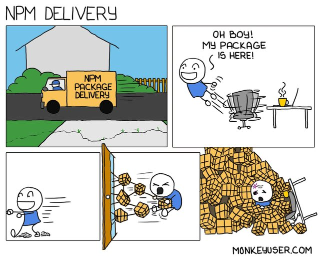

A primer on developing private NPM packages.

# Packages galore



_The problem we want to avoid!_

Outlined are the procedures and guidelines for private NPM package development. This guide is inspired by an old dev team I was on, and frankly this has served me time and time again when working on internal NPM packages at other companies.

One of the fundamental principles a Web Development team should embrace is the software programming ideals behind the old Unix philosophy - You should strive to build short, clear, modular, reusable, composable, and extensible code whenever possible.

Certainly, the best way to realize such ideals is by taking full advantage of NPM by using NPM for importing 3rd-party open-source packages. Additionally, it is also used to manage and host one’s own internal shared libraries as private NPM packages.

## Setup

To keep things simple, imagine you've just joined a new team as a Full Stack Engineer - congrats! 🎉 The project tech stack has several private NPM packages specific to your team's application, perfect for this guide!

The typical first steps when working on a new project or onboarding with a new team would be to clone the project repository and run `npm install`.

```sh
$ git clone https://github.com/<user-name>/<project>.git
$ cd <project>/
$ npm install
```

You’ll also need to set up the `NPM_TOKEN` environment variable, which holds the NPM access token used for reading packages from, and publishing packages to, your NPM organization. More on this later.

## Basic Workflow

Let's talk about workflows... Every organization is different, and there might be some extra steps that aren't present from this example workflow. However, the fundamentals of this workflow will get you by swimmingly!

An example of a typical development workflow might look like the following:

1. Create a branch
2. Make changes
3. Run Unit tests
4. Iterate
5. Submit a PR
6. Get a code review from at least two teammates
7. Iterate some more
8. Merge into Master upon approval

And so on and so forth... No need to overcomplicate it.


_SHARK TEETH!_


## Building and Publishing

Assuming you’ve followed the usual development workflow, and your changes have been merged into the Master branch, next would be to create a new Task (or Ticket) in your project management software and corresponding Task branch (e.g., `T123`). Give the task the same name as well as the version being published (e.g. `“0.13.0”`). Checkout the branch, and follow the steps below to publish a new version of a private NPM package.

```sh
# If there are tests, ALL must pass!
$ npm test

# This bumps the version and creates a git tag for you
$ npm version <segment>

# This compiles into the lib/ directory using Babel
$ npm run build

# This publishes to a NPM repo (using the NPM credentials provided by your organization)
$ npm publish

# This pushes up the git tag that was created by `npm version`
$ git push --all --follow-tags
```

Upon completion of these steps, you'll need to open a Pull Request just like you would for any other change. The diff should be extremely simple, just check the version in `package.json` as it should change.

## Determining Versions

This may not align with your organization's rulebook, and that's okay. If you have the choice to establish Versioning guidelines, then this will hold up well for you!

So which version segment to bump? Often it's best to use Semantic Versioning for shared libraries.

What this means is given a version number **MAJOR.MINOR.PATCH**, increment the:

- **MAJOR** version when you make incompatible API changes
- **MINOR** version when you add functionality in a backwards-compatible manner
- **PATCH** version when you make backwards-compatible bug fixes.

In other words...

Bump the **MAJOR** version segment whenever you make a backwards-incompatible change to the interface of any utility defined in the library to be published for example:

- Changing method or function signatures
- Changing input types
- Changing return value types
- Removing public methods or classes
- Changing the name or location of methods, classes, etc..

Bump the **MINOR** version segment whenever you make a backwards-compatible change to the library that's more than just a bug fix. Examples would be:

- Adding new methods or classes
- Refactoring internal implementation details

Bump the **PATCH** version segment whenever you fix a bug in a backwards-compatible manner and are not making any other changes to the library.

- npm version patch

Updating NPM dependencies that the library uses constitutes at minimum a **MINOR** version bump. If you were changing a dependency that leads to further interface-level changes or breaking side-effects, then it may constitute a **MAJOR** version bump.

### Private NPM Credentials

In order to publish or install private packages to and from your NPM organization, you must provide valid credentials via the `NPM_TOKEN` environment variable. Be sure to export it from your `~/.bash_profile`.

The one shown below is merely an example.

`export NPM_TOKEN=XXXXXXXX-XXXX-XXXX-XXXX-XXXXXXXXXXXX`

Most importantly... Do NOT commit the `NPM_TOKEN` value. It must be kept confidential, and if you believe it has become compromised, regenerate a new token immediately!